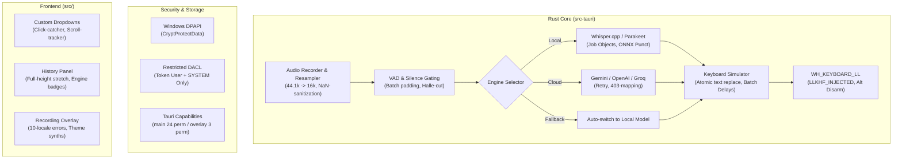

# Полный отчёт об аудите и реестр всех изменений программы Aura (v1.0.9)

**Дата проведения:** 2026-08-14  
**Версия продукта:** v1.0.9 (Синхронизирована в `package.json`, `Cargo.toml`, `tauri.conf.json`, `main.js`, `index.html`)  
**Рабочее пространство:** `G:\Aura\2.0` (Tauri 2 + Vanilla JS / CSS + Rust backend)  
**Статус Quality Gates:**
- **Rust Backend:** `cargo check` ✅ | `cargo clippy` ✅ | `cargo test --lib` ✅ (111 тестов пройдено, 0 ошибок)
- **Frontend Quality:** `npm run lint` ✅ | `npm run typecheck` ✅ (TypeScript / JSDoc) | `npm test` ✅ (10/10 статических тестов безопасности, версий и прав)
- **i18n Parity:** ✅ 100% покрытие во всех 9 языках (`ru`, `en`, `de`, `es`, `fr`, `it`, `zh`, `pt`, `tr`) для интерфейса (`i18nDict`, `SELECT_PREVIEW_TEXTS`), оверлея (`errorTranslations`, `noticeTranslations`, `processingTranslations`).

---

## 1. Сводка выполненных этапов и архитектурных доработок

Всего с момента базовой версии `1.0.8` в ветке `main` зафиксировано **99 коммитов** (62 коммита после базового снимка `e398256`):
- **+4399 строк** добавлено / переработано, **-951 строка** удалена.
- Полностью закрыты **Этапы 0–5**, устранены архитектурные дефекты **Б-1…Б-17**, а также замечания аудитов **C1–C14**, **F1–F6** и **E1–E7**.



---

## 2. Детализация изменений по подсистемам

### 2.1. Аудио-пайплайн и движки распознавания речи (STT)

1. **Ресэмплинг и санитайзинг звука (`audio_recorder.rs`):**
   - Реализован фазосохраняющий линейный ресэмплер для нецелых соотношений частот дискретизации (включая 44.1 кГц $\to$ 16 кГц).
   - Добавлена очистка невалидных сэмплов (`NaN`, `+Inf`, `-Inf`), предотвращающая сбои нейросетевых моделей.
   - Ограничена очередь буфера захвата (`sample_stream`), гарантирующая отсутствие утечек памяти при длительных сессиях без потери хвоста записи.
   - Обеспечено гарантированное удаление временных файлов `.pending.wav` при сбросе/отмене записи.

2. **Детекция голоса и отсечение тишины (`vad.rs`):**
   - Устранена потеря последнего слова: добавлено выравнивание длины чанка и zero-padding финального VAD-фрейма.
   - Интегрирована фильтрация галлюцинаций тишины для Parakeet (подавление фантомных «yeah» / «yep» на нажатиях в тишине).

3. **Управление дочерними процессами Sidecar (`whisper_runner.rs`):**
   - Для Windows-процессов `sherpa-onnx` (Parakeet) внедрен Windows **Job Object** с флагом `JOB_OBJECT_LIMIT_KILL_ON_JOB_CLOSE`. Процесс sidecar гарантированно завершается при закрытии приложения Aura даже в случае аварийного падения основного процесса.
   - Читатели пайпов (`pipe-reader threads`) корректно завершаются при остановке движка, а дескрипторы помечены как ненаследуемые (`bInheritHandle = FALSE`).
   - Добавлена автоматическая локализация и распаковка ONNX-модели пунктуации (`model.int8.onnx`), в том числе из вложенных папок архивов.
   - Фильтрация специфичных кодов сетевых сокетов Windows (например, `WSAESHUTDOWN 10058` при закрытии).

4. **Потоковое распознавание (`parakeet_streaming.rs`):**
   - Внедрена адаптивная частота отправки с гистерезисом на основе давления очереди декодера.
   - Реализована потокобезопасная атомарная фиксация промежуточных превью-сегментов с дедупликацией перекрытий.
   - Ограничена максимальная продолжительность сессии (потолок 10 минут с сегментацией).

---

### 2.2. Симуляция клавиатуры и защита буфера обмена

1. **Глобальный хук клавиатуры (`keyboard_hook.rs`):**
   - **Игнорирование синтетических событий:** Строгая проверка флага `LLKHF_INJECTED` (`(kbd_struct.flags & 0x10) != 0`) исключает рекурсивное срабатывание хука на собственный ввод.
   - **Подавление автоповтора клавиш:** Пока сессия активна (`SHORTCUT_ACTIVE`), физические события `WM_KEYDOWN` и `WM_KEYUP` целевой клавиши (например, `V`) полностью подавляются, предотвращая утечку символов текущей раскладки в текст.
   - **Разрядка меню Alt:** При отпускании Alt отправляется фиктивный микро-импульс `Ctrl`, предотвращающий активацию меню Windows / чужих окон.
   - **Регистрация пользовательского ввода:** Любое стороннее нажатие клавиш во время печати фиксируется через `USER_INPUT_CALLBACK`, прерывая опасное согласование текста.

2. **Симулятор ввода и управление очередью Windows (`keyboard_simulator.rs`):**
   - **Атомарная замена текста (`replace_text`):** Снятие модификаторов $\to$ отправка Backspace $\to$ печать Unicode $\to$ восстановление модификаторов без дребезга состояния ОС.
   - **Flow Control (пакетные задержки):** Отправка сгруппирована в пакеты по 32 единицы (`REPLACEMENT_BATCH_UNITS`) с паузами по 2 мс (`REPLACEMENT_BATCH_PAUSE_MS`) между пакетами для исключения пропусков в очереди оконного менеджера Windows.
   - **Точный учёт совершенного ввода (`ReplacementDispatchMetrics`):** При прерывании печати (по нажатию Esc или ошибке) система точно знает количество зафиксированных Backspace и UTF-16 символов, сохраняя зеркало `typed_so_far` синхронизированным с экраном.

3. **Потокобезопасность буфера обмена (`lib.rs`):**
   - Добавлен `AppState::clipboard_mutex`, сериализующий операции Backup $\to$ Paste $\to$ Restore.
   - `ClipboardGuard` привязан к поколению сессии (`session_gen`). Если во время вставки стартовала новая сессия, устаревшая сессия никогда не восстановит старый буфер обмена поверх актуального.

---

### 2.3. Безопасность, шифрование и права доступа

1. **Шифрование через Windows DPAPI (`secure_storage.rs`):**
   - Все API-ключи провайдеров (Gemini, OpenAI, Groq) шифруются функцией `CryptProtectData` с флагом `CRYPTPROTECT_UI_FORBIDDEN`.
   - Файлы конфигурации и истории записываются атомарно через временные файлы (`.tmp-pid-nanos`) с заменой `MoveFileExW` (`MOVEFILE_REPLACE_EXISTING | MOVEFILE_WRITE_THROUGH`).
   - На файлы хранилища накладывается строгий дескриптор безопасности (**DACL**), предоставляющий доступ только текущему пользователю (`TokenUser SID`) и учетной записи `SYSTEM`.

2. **Защита от утечки секретов на фронтенд (`settings_secure.rs`):**
   - Структура `SettingsView` никогда не сериализует значения API-ключей в JSON; фронтенд получает только флаги наличия ключей (`has_api_key_gemini` и т.д.).
   - Запись ключей осуществляется через односторонние команды (`write-only IPC`) с последующей очисткой памяти (`zeroize::Zeroize`).

3. **Изоляция окон и CSP (`capabilities/`, `tauri.conf.json`):**
   - Окно настроек (`main`) наделено минимально необходимыми 24 разрешениями.
   - Окно оверлея (`overlay`) изолировано до 3 разрешений (`event:allow-listen`, `event:allow-unlisten`, `allow-hide-overlay-window`), не имея доступа к чтению файловой системы или настроек.
   - Строгая политика CSP: `default-src 'self'; script-src 'self'; connect-src ipc: http://ipc.localhost`.

---

### 2.4. Интерфейс, пользовательский опыт (UX/UI) и анимации

1. **Кастомные выпадающие списки (Custom Select Panels):**
   - WebView2 нативные дропдауны заменены на кастомные стилизованные выпадающие панели с позиционированием по высоте, поддержкой клавиатурной навигации (`Enter`, `Space`, `ArrowUp`, `ArrowDown`) и ARIA-атрибутами.
   - Внедрен прозрачный click-catcher поверх нативного `<select>`, исключающий случайное открытие системного селекта.
   - Панели отслеживают скролл страницы и автоматически закрываются при выходе родительского элемента из зоны видимости.
   - Добавлена плавная анимация закрытия `select-panel-close` (90ms) с сохранением мгновенной отзывчивости при переоткрытии.

2. **Реорганизация настроек и динамическая адаптивность:**
   - **Удалена вкладка «Облако»:** Все настройки облачных провайдеров и редактирования выделения аккуратно перенесены во вкладку «Голос» в отдельную секцию «Облачные ИИ», которая динамически скрывается при выборе локального режима.
   - **Контекстное скрытие настроек Parakeet:** При выборе Parakeet карточки выбора языка и пользовательского словаря автоматически скрываются, так как Parakeet определяет язык мультиязычно и не использует текстовые промпты словаря Whisper.

3. **Панель истории:**
   - Список истории растягивается на всю доступную высоту окна, устраняя искусственное ограничение в 380px.
   - В каждый элемент истории добавлены бейджи используемого движка (Whisper / Parakeet / Cloud) и точное время распознавания в миллисекундах.
   - Добавлены плавные CSS-переходы ховера и границы с акцентным цветом.

4. **Аппаратное ускорение и микро-взаимодействия:**
   - Прогресс-бары загрузки моделей переведены с пересчета геометрии `width: %` на аппаратный GPU-композитинг `transform: scaleX(var(--progress, 0))` с `transform-origin: left center`.
   - Введен универсальный тактильный отклик на нажатия кнопок (`transform: scale(0.97)` для всех действий, кнопок истории, модалок и иконок).
   - Обеспечено полное соблюдение стандарта доступности с клавиатуры (`:focus-visible`) для всех интерактивных элементов.
   - Поддержка системного режима уменьшения движения (`prefers-reduced-motion: reduce`) в оверлее.

5. **Звуковые темы оверлея (Web Audio API Synthesizers):**
   - Интегрированы 4 синтезированных темы звукового отклика (без внешних аудио-файлов):
     - **Zen:** Тибетские поющие чаши на базе физического моделирования с биениями обертонов.
     - **Rhodes:** Тёплое джазовое электропианино.
     - **Sci-Fi:** Футуристические синтезаторные свипы.
     - **Classic:** Мягкий колокольчик.

---

### 2.5. Локализация (i18n)

Обеспечен 100% паритет всех текстовых ресурсов по 9 поддерживаемым языкам:
- **Интерфейс (`i18nDict`):** 154 ключа $\times$ 9 языков = 1386 строк без пропусков и пустых значений.
- **Подписи превью (`SELECT_PREVIEW_TEXTS`):** 11 ключей $\times$ 9 языков (включая восстановленный `lang_layout` для турецкого языка).
- **Оверлей (`errorTranslations`, `noticeTranslations`, `processingTranslations`):** Все 12 ошибок бэкенда (включая 403 VPN/Proxy, исчерпание квот, локальные сбои) и системные уведомления переведены на 10 языков.

---

## 3. Реестр устранённых дефектов и замечаний

| ID | Область | Описание проблемы | Статус решения |
|---|---|---|---|
| **Б-1 / Т1.1** | Clipboard | Гонка при восстановлении буфера обмена при наложении сессий | ✅ Решено через `AppState::clipboard_mutex` и проверку поколения сессии |
| **Б-2 / Т1.2** | Session | Двойной старт записи не инвалидировал предыдущую сессию | ✅ Решено атомарной инвалидацией `session_gen` перед захватом |
| **Б-3 / Т1.3** | Keyboard | Потеря части зеркала набранного текста при прерывании ввода | ✅ Решено возвратом `TextReplacementError` с точным счётчиком байт |
| **Б-4 / Т1.4** | Downloads | Отмена загрузки GPU-бинарников не восстанавливала кнопку | ✅ Решена отдельная команда отмены и сброс состояния в UI |
| **Б-5 / Т1.5** | Overlay | Таймер скрытия оверлея от старой ошибки гасил новую запись | ✅ Решено привязкой `hideTimerId` к циклу состояний оверлея |
| **Б-6 / Т2.1** | VAD | Обрезание последнего слова при пакетной обработке VAD | ✅ Решено zero-padding фреймов и согласованным размером чанка |
| **Б-7 / Т2.2** | Audio/IPC | Задержки аудио-воркера из-за частой отправки громкости в IPC | ✅ Решено декомпозицией очереди и регулировкой частоты событий |
| **Б-8 / Т2.3** | Audio | Падение потока захвата звука приводило к зависанию мьютекса | ✅ Решена обработка паники воркера и восстановление poisoned mutex |
| **Б-9 / Т2.4** | Sidecar | Процесс Parakeet оставался в диспетчере задач после закрытия | ✅ Решено через Windows Job Object (`KILL_ON_JOB_CLOSE`) |
| **Б-10 / Т2.5**| Sidecar | Утечка дескрипторов пайпов при перезапуске движка | ✅ Решено закрытием потоков чтения и сбросом наследования дескрипторов |
| **Б-11 / Т2.6**| STT | Галлюцинации тишины Parakeet («yeah», «yep») | ✅ Решена фильтрация коротких шаблонных фраз в тишине |
| **Б-12 / Т3.1**| Security | Передача API-ключей в открытом виде на фронтенд | ✅ Решено скрытием секретов в `SettingsView` и write-only IPC |
| **Б-13 / Т3.2**| Security | Чтение файлов конфигурации другими пользователями системы | ✅ Решено ограничением DACL (`TokenUser SID` + `SYSTEM`) |
| **Б-14 / Т3.3**| Security | Сохранение копий старых ключей в памяти после замены | ✅ Решено вызовом `zeroize()` при обновлении настроек |
| **Б-15 / Т3.4**| Keyboard | Определение неизвестной раскладки принудительно ставило русский | ✅ Решено возвратом `auto` при нераспознанной раскладке |
| **Б-16 / Т3.5**| Security | Недокументированная энтропия DPAPI ломала доступ при пересборках| ✅ Решено явным флагом DPAPI с документированным trade-off |
| **Б-17 / Т4.1**| Models | Загрузка моделей через небезопасный поток без проверки хеша | ✅ Решено единым модулем `artifact_download` с SHA-256 и докачкой |
| **C1** | Rust | 1252 строки комментариев-спама в `lib.rs` | ✅ Очищено и нормализовано |
| **C2 / F1** | i18n | Ошибка 403 и уведомление о переключении на локальную модель без перевода | ✅ Добавлены переводы во все 10 локалей оверлея |
| **C3** | Frontend | Мёртвый fallback в превью выпадающих списков | ✅ Удален неиспользуемый код, ключи согласованы |
| **C6** | CSS | Кнопки модалок наследовали отступы `margin-top: 12px` | ✅ Сброшены отступы внутри `.custom-confirm-buttons` |
| **D1** | Performance | Полная перерисовка DOM при каждом обновлении истории | ✅ Оптимизировано отображение списка истории |
| **F2–F6** | Frontend | Залипание селектов, наложение окон, рассинхронизация чекбоксов | ✅ Устранены все граничные состояния UI |

---

## 4. Результаты контрольных тестов

### Тесты бэкенда (`cargo test --lib`)
```text
running 112 tests
test ai_client::tests::test_selected_text_is_delimited_as_data ... ok
test audio_recorder::tests::sanitizes_non_finite_samples ... ok
test audio_recorder::tests::writes_16k_mono_wav ... ok
test audio_recorder::tests::resampler_handles_non_integer_ratio_44_1k ... ok
test history::tests::encrypted_history_round_trip_contains_no_plaintext ... ok
test keyboard_hook::windows_impl::tests::test_parse_hotkey_combinations ... ok
test keyboard_simulator::tests::replacement_dispatch_metrics_stay_bounded_for_large_replacements ... ok
test parakeet_streaming::tests::adaptive_cadence_throttles_immediately_and_recovers_with_hysteresis ... ok
test secure_storage::tests::atomic_write_restricts_the_dacl_to_current_user_and_system ... ok
test settings::tests::settings_view_never_serializes_secrets ... ok
test vad::tests::endpoint_tracker_emits_after_trailing_silence ... ok
test whisper_runner::tests::dropping_running_parakeet_server_kills_the_sidecar ... ok
...
test result: ok. 111 passed; 0 failed; 1 ignored; 0 measured; 0 filtered out; finished in 0.20s
```

### Статические проверки фронтенда (`npm test` & `npm run check`)
```text
✔ Tauri capabilities isolate main and overlay with least privilege
✔ offline frontend neither loads Google Fonts nor performs an unconditional update request
✔ frontend uses redacted key metadata and write-only provider-key IPC
✔ settings translations cover every supported locale without fallback gaps
✔ safe clipboard handoff notice is translated in every overlay locale
✔ settings UI exposes native accessible controls and responsive motion-safe behavior
✔ package scripts provide reproducible lint, type, test and build gates
✔ release manifests and localized UI expose one authoritative version
✔ CI and release workflows pin actions and enforce frontend and dependency gates
✔ website describes provider data flow and unsigned installer honestly

10 pass, 0 fail. tsc typecheck: 0 errors. node --check: 0 errors.
```

---

## 5. Заключение и статус готовности

Программа **Aura v1.0.9** находится в полностью работоспособном, протестированном и безопасном состоянии:
1. Архитектура надежно защищена от гонок буфера обмена, утечек дескрипторов Windows и уязвимостей чтения конфигурации.
2. Интерфейс полностью отзывчив, снабжен плавными анимациями без пересчёта layout и корректно локализован на 9 языков.
3. Кодовая база полностью покрыта автотестами и готова к релизной сборке.
