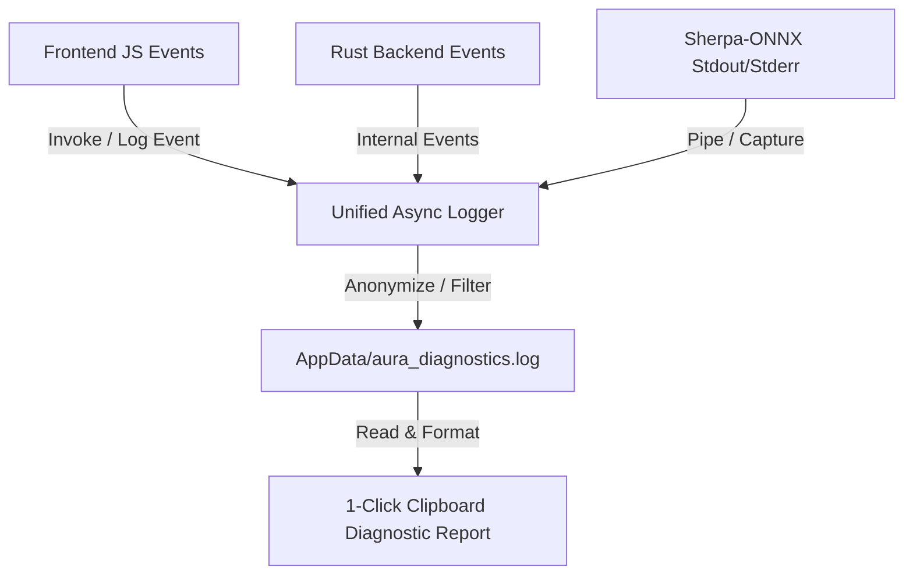

# Diagnostics & Unified Logging System Design Specification

## Overview
Aura requires a unified, privacy-first, multi-process diagnostic logging and reporting system. The system enables both developers and end-users to inspect application health, troubleshoot component failures (CUDA, DLLs, WebSocket servers, audio I/O), and export comprehensive diagnostic summaries in 1 click without exposing private user speech data by default.

---

## Key Features

### 1. Privacy-First Logging & Anonymization
- **Default Privacy Mode**: By default, transcribed user speech text is **never** logged in plain text. Speech output is replaced with anonymous metadata:
  `[ASR] Final result: [REDACTED: 5 words, 28 chars]`
- **Developer Debug Toggle**: A setting in `Settings` (`log_speech_text: bool`, default: `false`). When enabled by a developer, exact text outputs are included in diagnostic logs for accuracy troubleshooting.

### 2. Multi-Process Correlation & Log Aggregation
- **Unified Log File**: Written to `AppData/Local/com.aura.app/aura_diagnostics.log`.
- **Async Non-Blocking I/O**: High-performance asynchronous append loop to prevent I/O audio buffer dropouts during active recording.
- **Log Rotation**: Automatic rotation with a maximum file size limit (10 MB, keeping 2 historical backup files).
- **Session Correlation ID**: Every recording attempt generates a unique `#session-<timestamp>` tag that correlates events across Tauri Rust backend, WebView JS frontend, and `sherpa-onnx` sidecar server.

### 3. Log Levels & Categorization
- `[DEBUG]`: Internal state transitions, audio buffer sizes, granular socket frames.
- `[INFO]`: Hotkey press/release, model startup, transcription duration, successful text injection.
- `[WARN]`: Expected fallbacks (e.g. CUDA fallback to CPU sidecar, missing optional offline punctuation model).
- `[ERROR]`: Unrecoverable failures (missing mandatory files, permission denied, API connection failure).

### 4. 1-Click UI Diagnostic Export
- Positioned in `Settings` -> `About` tab (or footer status bar).
- Button: `[ 📋 Скопировать отчет диагностики ]` (`Copy Diagnostic Summary`).
- Generates a clean Markdown snippet directly into clipboard containing:
  - App & System Specs (App Version 1.0.8, OS version, GPU model, VRAM, active engine & acceleration).
  - Component Verification Status (CUDA DLLs, Parakeet model files, Whisper sidecar).
  - Last 50 lines of the unified session log.

---

## Technical Data Flow

